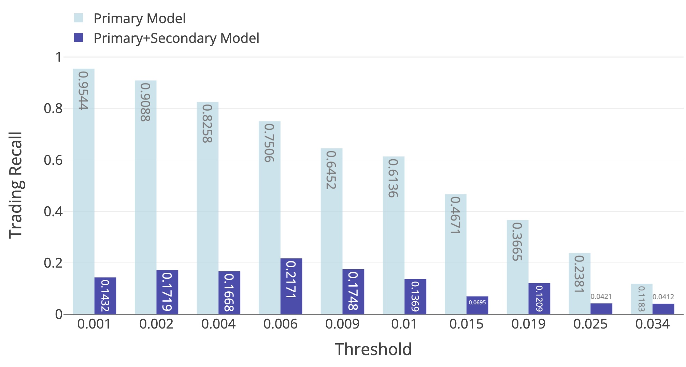

# LSTM and Meta-labeling

An implementation applying meta-labeling to minute-frequency stock data. Utilized LSTM as the primary model for price direction prediction (side), upon which a trading strategy is built. A secondary meta-labeling layer (size) helps to filter false positives and improve risk-return metrics.

This repository is a reorganisation of [my master's dissertation](assets/paper/Using%20LSTM%20Model%20for%20Meta-labeling%20in%20Quantitative%20Trading%20%20A%20Practical%20Analysis%20with%20Minute%20Stock%20Data.pdf). 

1. Using minute-level price and volume data of Apple, 20 technical indicators are derived and used as input for a LSTM model to predict the price movement.
2. Based on this side prediction (up or down), a threshold mechanism is used to construct the underlying trading strategy.
3. Then, meta-labeling applies a secondary model to assess the credibility of this trading decision. It utilize addtional features to predict the appropriate trading size. Meta-labeling helps to refine trading signals, filtering false positives and improving the profitability of trading strategies.
4. Two different position sizing methods, all-or-nothing and ECDF, are compared. Both classification metrics for machine learning model (precision and recall) and risk-return metrics for strategy (Sharpe) are used to evaluate the efficiency of LSTM and meta-labeling.

## Table of Contents
- [LSTM and Meta-labeling](#lstm-and-meta-labeling)
  - [Table of Contents](#table-of-contents)
  - [0. Thoughts after Five Months](#0-thoughts-after-five-months)
  - [1. Meta-labeling](#1-meta-labeling)
    - [Classifier’s Performance Metrics vs. Strategy’s Risk-return Metrics](#classifiers-performance-metrics-vs-strategys-risk-return-metrics)
    - [Motivation for Meta-labeling](#motivation-for-meta-labeling)
    - [Primary Model: Predicting the Side](#primary-model-predicting-the-side)
    - [Secondary Model: Predicting the Size](#secondary-model-predicting-the-size)
    - [4 Benefits of Meta-labeling](#4-benefits-of-meta-labeling)
  - [2. LSTM](#2-lstm)
  - [3. Implementation](#3-implementation)
    - [3.1 Data and Features](#31-data-and-features)
      - [Features for the Primary Model: Technical Indicators](#features-for-the-primary-model-technical-indicators)
      - [Features for Secondary Model](#features-for-secondary-model)
    - [3.2 Preprocessing](#32-preprocessing)
    - [3.3 Model Details](#33-model-details)
    - [3.4 Cross-validation](#34-cross-validation)
    - [3.5 Trading Strategy](#35-trading-strategy)
      - [3.5.1 Threshold Mechanism for Raw Trading Signals](#351-threshold-mechanism-for-raw-trading-signals)
      - [3.5.2 Final Trading Strategy: All-or-Nothing Method](#352-final-trading-strategy-all-or-nothing-method)
      - [3.5.3 Final Trading Strategy: ECDF Method](#353-final-trading-strategy-ecdf-method)
  - [4. Results](#4-results)
    - [4.1 Experiment 1: Primary Model](#41-experiment-1-primary-model)
    - [4.2 Experiment 2: Meta-labeling with All-or-Nothing Trading Method](#42-experiment-2-meta-labeling-with-all-or-nothing-trading-method)
      - [4.2.1 Performance of LSTM](#421-performance-of-lstm)
      - [4.2.2 Metrics Related to Trading Confusion Matrix](#422-metrics-related-to-trading-confusion-matrix)
      - [4.2.3 Strategy-related Metrics](#423-strategy-related-metrics)
    - [4.3 Experiment 3: Meta-labeling with ECDF Method](#43-experiment-3-meta-labeling-with-ecdf-method)
    - [4.4 Experiment 4: All Features in Primary Model (Control Group)](#44-experiment-4-all-features-in-primary-model-control-group)
  - [Main Reference](#main-reference)

## 0. Thoughts after Five Months

Altough this is a relatively complete study, and the implementation involves a certain amount of technical details, the current practical value is quite limited and there's a lot of room for improvement. The deficiencies in each area are listed below.

**LSTM**

1. In the primary model, I used almost exclusively readily available technical indicators from TA-lib. Technical indicators based entirely on volume data have limited information, at least feature selection can be performed.
2. The data for different dates are considered to be continuous time series without interruptions, without taking into account market closures. The simplest solution would be adding an additional feature indicating time elapsed since market open.
3. The label to predict in the primary model is binary up or down in next minute. Such labelling method is coarse and difficult for the model to learn. Also, for data points with high absolute returns and data points with almost zero absolute returns, the model gives them the same importance. They should be viewed differently and the weighting of samples can be applied.
4. In expanding window cross-validation, the accuracy of LSTM decreases as the length of training set increases, indicating the need to re-train model using up-to-date data more frequently.

**Meta-labeing**

1. Meta-labeling is considered to tackle the trade-off between trading precision and recall. But as the threshold changes, the changes in precision and recall are not synchronised. Recall decreases slowly, while precision remains almost constant until a sudden increase after a certain value. This leads to the benefits of meta-labelling not being effictively tested. This is actually also due to the poor performance of the LSTM in the prime model.
2. In the secondary model, the original features used by the primary model are used in the hope that more information would be extracted. In this sense, a heterogeneous model (a non-LSTM model) in the secondary model would be more appropriate.
3. An additional comparison should be carried out to show that the improved metrics are actually attributed to meta-labeling, instead of the introduction of additional features in the secondary model. This should be the crucial part to show the effect of meta-labeling. It is not included due to the word limit of my dissertaion requirement.

**Trading Strategy**

1. Information leak when proprocessing data. Although min-max scaling is done after spliting training and testing sets, future information which is not accessible back in time is still used. Solution: use rolling minimum and maximum to perform min-max scaling
2. The backtest is a rather simple vectorised backtest, in which transaction costs, including commission fees and bid-ask spreads, are not taken into account. With such a high frequency of trading, the fina risk-return metrics must be distorted.

**Code**

1. Hard to read. Confusing varialbe name.
2. Jupyter notebook is used exclusively, resulting in unnecessary code duplication and coupling between different parts. 

## 1. Meta-labeling

Meta-labeling is proposed by Lopez de Prado in [Advances in Financial Machine Learning](https://www.wiley.com/en-gb/Advances+in+Financial+Machine+Learning-p-9781119482086). It addresses the challenge faced by practitioners who possess a model for predicting the direction of investment (long or short) but require a separate model to determine the position size (amount of money investing in that bet).

Meta-labeling involves applying a secondary machine learning model on top of a primary classifier to assess the quality or reliability of the primary model. By combining the secondary and primary models, it is possible to filter out false positives, which in turn improves the strategy’s risk-return metrics.

### Classifier’s Performance Metrics vs. Strategy’s Risk-return Metrics

Trading Confusion Matrix

To evaluate the effectiveness of the classification model, precision, recall, and F1-score serve as common performance metrics:

- **Precision** measures the proportion of correctly predicted positive instances (profitable trades) out of all instances predicted as positive, indicating the model’s ability to avoid false positives (losing trades). 

- **Recall** measures the proportion of correctly predicted positive instances (profitable trades) out of all actual positive instances (potential opportunities), reflecting the model’s ability to avoid false negatives or capture profitable trades. 
- F1 score is a combination of both.

How can the model’s performance metrics, such as precision and recall, be related to the risk-return metrics of the strategy, eg. **Sharpe ratio**?

Consider the following example derived from [Advances in financial machine learning](https://www.wiley.com/en-gb/Advances+in+Financial+Machine+Learning-p-9781119482086). Suppose a strategy generates $n$ independent and identically distributed (IID) bets per year, with each bet having a probability $p$ of generating a profit of $\pi$ and a probability $1-p$ of incurring a loss of $-\pi$. If we define $X_i$ as the outcome, with $P[X_i=\pi]=p$ and $P[X_i=-\pi]=1-p$, then $p$ represents the precision of a binary classifier. The annualized Sharpe ratio can be calculated as follows:

$$SharpeRatio = \frac{Return}{StandardDeviation} = \frac{nE[X_i]}{\sqrt{nV[X_i]}} = \frac{2p-1}{2\sqrt{p(1-p)}} \sqrt{n}$$

In the case of symmetric profits and losses, the risk-adjusted performance of the strategy is positively correlated with precision and the number of investment opportunities (recall). These conclusions hold true for asymmetric payouts as well.

**Conclusion**: to achieve a high Sharpe ratio strategy, **both high-recall and high-precision** classifiers are necessary for predicting whether to trade or not.

### Motivation for Meta-labeling

**However**, it can be challenging to train a classifier that achieves both high recall and high precision due to the inherent **trade-off** between these two metrics. Increasing recall involves capturing a broader range of positive instances, but it can lead to more false positives and lower precision. Conversely, maximizing precision requires being more cautious in classifying instances, potentially resulting in missed positive instances and lower recall.

One motivation for employing meta-labeling is to effectively use this trade-off between recall and precision to achieve better risk-return performance. The appropriate balance between these metrics depends on the specific characteristics of the investment strategy. For example, in high-frequency trading, precision may be prioritized due to the limited profit per trade and the abundance of trading opportunities. Conversely, in medium to long-term momentum strategies, recall may be more crucial given the potential profitability of individual trades.

Furthermore, meta-labeling offers additional motivations stemming from its architecture, which involves separating side prediction from size prediction. This separation brings several benefits, including improved interpretability, prevention of overfitting, and enhanced flexibility.

### Primary Model: Predicting the Side

The meta-labeling framework consists of a primary model and a secondary model. The primary model is responsible for **predicting the side of a profitable trade**, indicating whether to buy, sell, or close the position. In the following figure, the upper part illustrates the three possible labels: -1 for sell, 1 for buy, and 0 for no trade. This primary model represents a generic and commonly used approach for side prediction in trading.

The primary model can take various forms, encompassing discretionary or quantitative strategies, rulebased or model-based approaches, and traditional methods or machine learning algorithms.

**When the primary model is a machine learning model, there are two additional benefits**, as depicted in the lower part of the figure. Many machine learning classifiers output probabilities, $[0, 1]$, instead of direct class predictions. These probabilities are then subjected to a thresholding operation to obtain class predictions. For example, if the initial output probability is higher than a threshold $\tau_1$, it is transformed into a buy signal, if it is lower than $\tau_2$, it becomes a sell signal, and otherwise, it is transformed into a "no trade" signal ($0$).

1. The first benefit of machine learning models is that the **trade-off between recall and precision can be adjusted through the threshold values**. If two thresholds $\tau_1$ and $\tau_2$ overlaps, where all signals are either buy or sell, recall is 1 because no trades are missed, but precision is typically low. By setting a higher gap between two thresholds, the frequency of trades is reduced, leading to lower recall but potentially higher precision.

2. The second benefit is the ability to utilize predicted probabilities to compute **evaluation metrics** for the primary model, such as **rolling cross-entropy or rolling accuracy**. These metrics can serve as inputs for the secondary model, allowing for performance evaluation of the primary model over time.

### Secondary Model: Predicting the Size

The secondary model is a key component of the meta-labeling framework. It receives more input data than the primary model and **produces a meta-label indicating whether the output of the primary model is correct**. Specifically, the secondary model assesses whether the predictions made by the primary model will result in a profit or a loss. This assessment allows for adjustments to the size of the actual position, so it is said that the secondary model predicts the size of positions.

The initial output of the secondary model is a value between 0 and 1, representing the confidence level of the primary model. Various **position sizing methods** can be applied based on this output: 

1. For instance, an **all-or-nothing** strategy invests a full unit of position when the secondary model’s probability of a positive outcome exceeds a certain threshold, while not investing at all when it falls below the threshold. 
2. A more sophisticated position sizing method **allocates more capital to high-confidence trading signals**. The higher the probability of true positive (profitable trade), the greater the investment amount. Approaches such as using the empirical cumulative distribution function can be employed for this purpose.

The secondary model takes four types of data as inputs:

1. Firstly, it receives **the output of the primary model**. 
2. Secondly, it incorporates **the original features used** by the primary model. As the secondary model may employ a different model type, it has the potential to uncover distinct information, providing an informational advantage. 
3. The third input is **evaluation data**, which assesses the recent performance of the primary model. This evaluation helps determine if the primary model should be deactivated. 
4. Lastly, **additional features** are utilized to assess the suitability of the primary model for the current market conditions. These additional features can include macro indicators (e.g., inflation rate, yield curve slope) that relate to the market environment. Other options encompass price moments (e.g., skewness, kurtosis), which reflect shifts in the statistical distribution of an asset. Such shifts may render the primary model inappropriate for the current market.

In summary: the secondary model uses more features and different model, which helps to screen out false negatives. By this, informational advantage is gained and overfitting is avoided by decoupling the prediction of side and size. Additionally, multiple position sizing methods can be implemented to suit specific investment needs. Finally, more complex frameworks can be applied, such as having separate secondary models for buy and sell signals.

### 4 Benefits of Meta-labeling

1. It allows machine learning models to be built on top of white-box models rooted in economic theory, addressing concerns about interpretability.
2. By separating side prediction from size prediction, overfitting issues are alleviated, as the primary and secondary models can use appropriate features independently.
3. The decoupling of side prediction from size prediction offers greater flexibility. Separate secondary models can be built exclusively for long and short positions, enabling better adaptation to market conditions and the construction of more suitable models.
4. Meta-labeling improves risk-return metrics by focusing on getting the most important predictions correct, preventing low returns from high accuracy on small bets and low accuracy on large bets.

## 2. LSTM

RNN:

LSTM:

$$f_t = \sigma(W_{fx}x_t + W_{fh}h_{t-1}+b_f)$$
$$i_t = \sigma(W_{ix}x_t + W_{ih}h_{t-1}+b_i)$$
$$o_t = \sigma(W_{ox}x_t + W_{oh}h_{t-1}+b_o)$$
$$\tilde{c}_t = tanh( W_{cx} x_t + W_{ch} h_{t-1} + b_c)$$
$$c_t = c_{t-1} \ast f_t + i_t \ast \tilde{c}_t$$
$$h_t = o_t \ast tanh(c_t)$$

1. Forget Gate

The forget gate determines the degree to which the previous memory cell state ($c_{t-1}$) is either forgotten or retained. It takes the current input ($x_t$) and the preceding hidden state ($h_{t-1}$) as inputs, which are then processed through a sigmoid activation function. The output, a forget gate vector ($f_t$), ranges from 0 to 1. This vector modulates the amount of the previous memory cell state ($c_{t-1}$) to retain ($c_{t-1}f_t$). A value close to 0 instructs the network to forget that component, whereas a value near 1 suggests retention.

2. Input Gate

The input gate manages the incorporation of new information into the memory cell. It utilizes the current input ($x_t$), and the prior cell and hidden states ($c_{t-1}$ and $h_{t-1}$) as inputs. Through a sigmoid activation function, it produces a gate vector ($i_t$) ranging from 0 to 1 to decide the amount of new information to store. Additionally, a tanh activation function generates a cell state candidate ($g_t$). The gate vector ($i_t$) acts as a filter, determining which parts of ($g_t$) are incorporated into the memory cell ($i_t g_t$). A value of 0 for ($i_t$) indicates ignoring the corresponding component, whereas a value of 1 suggests full inclusion. This filtered information is combined with the prior memory cell state to update the current cell state ($c_t$).

1. Output Gate
  
The output gate regulates the final output from the memory cell. It takes the current input ($x_t$) and previous hidden state ($h_{t-1}$) as inputs and employs a sigmoid activation function to produce an output gate vector ($o_t$) ranging from 0 to 1. This vector governs the influence of the current cell state ($c_t$) on the LSTM cell's final output ($h_t$). A value of 0 for ($o_t$) suppresses the output, whereas a value of 1 fully expresses it.

## 3. Implementation

### 3.1 Data and Features

The selected dataset consists of price and volume data for Apple’s stock at a minute-by-minute granularity. The data spans from October 2013 to December 2019, comprising a total of 610,980 entries.

#### Features for the Primary Model: Technical Indicators

| Category              | Feature        | Description                                             |
|-----------------------|----------------|---------------------------------------------------------|
| Price/Volume          | Open           | Opening price in the one-minute time frame              |
| Price/Volume          | High           | Highest price in the one-minute time frame              |
| Price/Volume          | Low            | Lowest price in the one-minute time frame               |
| Price/Volume          | Close          | Closing price in the one-minute time frame              |
| Price/Volume          | Volume         | Total trading volume in the one-minute time frame       |
| Price/Volume          | Return         | Percentage change of price in the one-minute time frame |
| Overlap Studies       | EMA(5 Min)     | Exponential moving average of close price (5 minutes)   |
| Overlap Studies       | EMA(10 Min)    | Exponential moving average of close price (10 minutes)  |
| Overlap Studies       | EMA(30 Min)    | Exponential moving average of close price (30 minutes)  |
| Overlap Studies       | SMA(5 Min)     | Simple moving average of close price (5 minutes)        |
| Overlap Studies       | SMA(10 Min)    | Simple moving average of close price (10 minutes)       |
| Overlap Studies       | SMA(30 Min)    | Simple moving average of close price (30 minutes)       |
| Momentum Indicators   | CCI            | Commodity Channel Index                                 |
| Momentum Indicators   | MACD           | Moving Average Convergence/Divergence                   |
| Momentum Indicators   | STOCHRSI       | Stochastic Relative Strength Index                      |
| Momentum Indicators   | WILLR          | Williams' \%R                                           |
| Volume Indicators     | AD             | Chaikin Accumulation/Distribution Line                  |
| Volume Indicators     | ADOSC          | Chaikin Accumulation/Distribution Oscillator            |
| Volatility Indicators | ATR            | Average True Range                                      |
| Cycle Indicators      | HT\_INPHASE    | Inphase phasor components of Hilbert transform          |
| Cycle Indicators      | HT\_QUADRATURE | Quadrature phasor components of Hilbert transform       |
| Statistical Function  | VAR(30 Min)    | Variance of the closing price (30 minutes)              |

[TA-lib](https://github.com/ta-lib/ta-lib-python) is used for calculating technical indicators.

#### Features for Secondary Model

As mentioned earlier, the secondary model encompasses a more extensive range of inputs compared to the primary model. It incorporates four distinct types of features, namely the primary model’s original inputs and outputs, evaluation data, and additional features.

**1. Incorporating Primary Model’s Prediction**

The primary model’s prediction of a stock’s upward or downward movement. This is a natural inclusion, as the secondary model’s purpose is to assess the credibility of raw trading signals generated by the primary model.

**2. Utilizing Primary Model’s Original Inputs**

The primary model’s original inputs, specifically the technical indicators. The rationale behind this is that the secondary model may be able to extract further relevant information from these original features.

**3. Leveraging Evaluation Data**

The third type of features utilized by the secondary model consists of evaluation data, specifically focusing on three key **performance metrics calculated from recent data: accuracy, precision, and cross-entropy, derived from the primary model’s performance over the last thirty minutes**. The primary model generates stock direction forecasts and raw trading signals at time $t$, and the secondary model assesses the credibility of these signals based on the primary model’s recent performance during the time period $t − 30$ to $t − 1$.

**4. Additional Features for Secondary Model**

The fourth type of additional features used by the secondary model aims to reflect the **overall market conditions and the nature of stock characteristics**. This allows us to observe the adaptability of the underlying strategy to changing market dynamics. 

For the market conditions, **S&P 500**’s minute closing prices and returns are included. Significant changes in these values may indicate shifts in the overall market sentiment, which could impact the performance of the primary model. 

For the distributional characteristics of the stock prices, the **skewness and kurtosis** of the stock traded are included. These statistical measures reflect the statistical distribution of the stock prices. Drastic changes in these moments may indicate a failure of the primary strategy to adapt to the changing dynamics of the traded stock.

### 3.2 Preprocessing

$$X_{scaled} = \frac{X- X_{min}}{X_{max} - X_{min}}$$

To avoid information leakage, we apply min-max scaling only after partitioning the data into training and test sets. This maintains the integrity of the data by ensuring that future information doesn't influence past data points.

### 3.3 Model Details

**Labels**

We'll apply LSTM to both primary and secondary models. In meta-labelling, primary and secondary models have separate target variables. 

Primary model predicts stock movement (up/down) in the next minute. These predictions form the raw trading signals, which are then transformed into buy, sell, or hold signals using a threshold mechanism, discussed in a later chapter.

$$
\begin{align}
y_{1, t} =
\begin{cases}
1 & \text{if the closing price of this minute is higher than the previous minute,} \\
0 & \text{otherwise}
\end{cases}       
\end{align}
$$

The secondary model predicts if primary's signals align with market behavior. It binary predicts primary's profitability. If buy signal aligns with rising close or sell signal with falling close, profit happens. The secondary model's predictive class is the meta-label.

$$
\begin{align}
y_{2, t} =
\begin{cases}
1 & \text{if the raw trading signal results in a profit,}\\
0 & \text{otherwise}
\end{cases}       
\end{align}
$$

**Stacked LSTM**

For minute-level stock prediction, we compare single-layer LSTM with two-layer LSTM architectures. Generally, the two-layer LSTM performs better across various hyperparameter combinations. 

Hence, we employ the two-layer LSTM for both primary and secondary models. It strikes a balance between efficiency and performance for our objectives. Note that a more rigorous approach using cross-validation could provide a stronger architecture assessment, but our resource limitations prevent its use here.

### 3.4 Cross-validation

Time series data demands maintaining chronological order, unlike traditional k-fold cross-validation. **Expanding window cross-validation** is adopted, progressively widening the training window over time. As illustrated in the figure, each step includes all data up to a point, validating the subsequent data points. This approach captures temporal dependencies effectively.

After training the primary model, we can obtain its prediction on the test set in each split. These four test sets also follow a chronological order. The secondary model will join the data from the four test sets, performs the expanding window cross-validation again, re-partitioning into the smaller training and test sets. The final backtest will be performed on the test set of the test set.

### 3.5 Trading Strategy

#### 3.5.1 Threshold Mechanism for Raw Trading Signals

If the predicted probability of a stock going up exceeds a certain threshold, a signal to open a long position is triggered. If the probability falls below another threshold, a signal to open a short position is triggered. Otherwise, a signal to close the position is activated.

The threshold mechanism is defined as follows:

$$
\begin{align}
\begin{cases}
\text{long, if $y_{1, t} > 0.5 + \tau$} \\
\text{short, if $y_{1, t} < 0.5 - \tau$} \\
\text{close, otherwise}
\end{cases}
\end{align}
$$

By adjusting $\tau$, traders can customize their trading strategy based on their risk tolerance and market outlook. A larger $\tau$ leads to more conservative trading with fewer but potentially higher-probability trades. Conversely, a smaller $\tau$ results in more aggressive trading.

There is no universally optimal value for $\tau$. The choice of $\tau$ is influenced by an investor's specific risk preference.

#### 3.5.2 Final Trading Strategy: All-or-Nothing Method

$$
\begin{equation}
    \text{trading unit} = \begin{cases}
\text{1, if $y_{2, t} > 0.5$} \\
\text{0, if $y_{2, t} \leq 0.5$}
\end{cases}
\end{equation}
$$

The final trading unit is determined based on the credibility of the secondary model's output with respect to a threshold value of $0.5$. 

The trading unit is set to $1$ if $y_{2, t}$ is greater than $0.5$, indicating high credibility in the primary model's signals. This means that we fully follow the primary model's signals and trade a complete unit. Conversely, if $y_{2, t}$ is less than or equal to $0.5$, the trading unit is set to $0$, indicating that we abstain from following the primary model's signals and do not trade at all regardless of the raw trading signals.

#### 3.5.3 Final Trading Strategy: ECDF Method

$$
\begin{equation}
    \text{trading unit = $ECDF(y_{2, t})$}
\end{equation}
$$

The second method utilizes an empirical cumulative distribution function (ECDF) to determine the final trading unit. 

The output of the secondary model ($y_{2, t}$) is passed through the pre-trained ECDF, resulting in a continuous value between $0$ and $1$. This approach offers a more granular response to the credibility of the primary model's signals. A higher value from the ECDF corresponds to higher credibility, leading to a higher number of final trades. Conversely, a lower value from the ECDF indicates lower credibility, resulting in fewer trades or no trades at all, even if the raw trading signals are present.

## 4. Results

### 4.1 Experiment 1: Primary Model

In the 4 splits in expanding window cross-validation, the primary model achieved accuracy of 55.09%, 54.26%, 53.74%, 52.22%, and 51.85% as the length of training set increases. 

It's not very high, but given that the data is minute frequency, every one per cent advantage provides a lot of trading opportunities. This demonstrates the ability of LSTM to mine information from just technical indicators obtained from price and volume market data. Additionally, the gradual decrease in accuracy may indicate the need to retrain the model using the up-to-date data (online-learning).

To assess the performance of the primary model at different trading thresholds ($\tau$), we construct base strategies accordingly.

### 4.2 Experiment 2: Meta-labeling with All-or-Nothing Trading Method

In Experiment 2, we explore the impact of meta-labeling using the all-or-nothing trading method. Here, the secondary model filters out false positives from the raw trading signals, and the predicted credibility from the secondary model is employed to generate the final traded signals. We report the results in three aspects: the LSTM model's performance metrics, metrics related to the trading confusion matrix, and strategy-related metrics.

#### 4.2.1 Performance of LSTM

As shown in the figure, the accuracy of the secondary LSTM model varies between 53.30\% and 87.80\% as $\tau$ changes. This demonstrates that models and additional information layered on top of the primary model can effectively exploit the information in the original features. Interestingly, we observe that the accuracy of the secondary LSTM model improves as $\tau$ increases. Two plausible explanations are put forth for this observation.

Firstly, as $\tau$ increases, the primary model incurs fewer losses. Although the overall mistake correction accuracy may be lower, the disproportionately large number of correctable mistakes leads to lower accuracy. This does not necessarily imply worse investment results, as the primary model's overall performance is less prone to losses.

Secondly, in the presence of a larger $\tau$, the primary model only trades when the stock price trend is strong. In such strongly trending market environments, the signal-to-noise ratio in the data is higher, enabling the secondary model to better correct mistakes.

#### 4.2.2 Metrics Related to Trading Confusion Matrix

To evaluate the performance, we refer to the trading confusion matrix. It is important to note that the terms "precision" and "recall" in this context differ from their usage in the previous subsection.

In the preceding subsection, the binary classification task involved determining whether the LSTM component of the secondary model correctly predicted adjustments for the raw trading signal. However, in this subsection, the binary classification task is focused on determining whether the combined trading signal from both the primary and secondary models will lead to profitable trades. To maintain clarity, we shall now refer to these metrics as "trading precision" and "trading recall" since they directly relate to the trading strategy.

Analyzing the change of recall, we observe that when the secondary model rejects certain raw trading signals, the trading recall naturally decreases, resulting in missed opportunities. On the other hand, the lower figure shows a significant increase in trading precision. Even with the simplicity of the all-or-nothing logic, the final strategy's probability of profit per trade improves. While meta-labelling does appear to manage the trade-off between precision and recall, its precise impact on risk-return metrics requires further investigation in subsequent analyses.

#### 4.2.3 Strategy-related Metrics

Analyzing Figure the curve of NAV, we observe that the impact of the all-or-nothing method of meta-labeling varies at different thresholds ($\tau$), resulting in distinct trends in the net asset value curves. Examining the investment metrics, we find that the annualized return becomes negative when $\tau$ equals 0.004. This indicates that, in this particular case, the application of meta-labeling leads to worse investments. However, in all other cases, the inclusion of meta-labeling enhances the Sharpe ratio, thereby improving the overall investment performance.

In conclusion, meta-labeling generally improves risk-return metrics by filtering out false positive investment signals and managing the precision-recall trade-off. Nonetheless, it's important to note that in specific scenarios, the all-or-nothing method of meta-labeling may lead to suboptimal investments. Furthermore, this approach results in significant variations in investment styles across different thresholds, which can pose challenges in selecting appropriate investment styles.

### 4.3 Experiment 3: Meta-labeling with ECDF Method

Comparing the NAV curves with those in Experiment 1, we observe that the overall trend remains largely consistent with the strategy generated by raw trading signals, with no significant changes in style. Analyzing the various strategy metrics and comparing them with those from Experiment 1, we find an improvement in the Sharpe ratio and maximum drawdown for all values of $\tau$. However, there is a decrease in annualized returns, leading to mixed results in the Calmar ratio for different $\tau$ values.

In conclusion, meta-labeling with the ECDF method enhances the strategy metrics without introducing drastic changes to the trading style. The improvements achieved with the ECDF method are more subtle and exhibit greater stability compared to the all-or-nothing method used in Experiment 2.

### 4.4 Experiment 4: All Features in Primary Model (Control Group)

## Main Reference

- [Lopez de Prado, Marcos (2018). Advances in financial machine learning](https://www.wiley.com/en-gb/Advances+in+Financial+Machine+Learning-p-9781119482086).
- [Joubert, Jacques Francois (2022). “Meta-Labeling: Theory and Framework”](https://www.pm-research.com/content/iijjfds/early/2022/06/23/jfds20221098)
- [Meyer, Michael, Barziy, Illya, and Joubert, Jacques Francois (2023). “Meta-Labeling: Calibration and Position Sizing”](https://www.pm-research.com/content/iijjfds/early/2023/03/08/jfds20231119)
- [Meyer, Michael, Joubert, Jacques Francois, and Alfeus, Mesias (2022). “Meta-Labeling Architecture”](https://www.pm-research.com/content/iijjfds/early/2022/09/16/jfds20221108)
- [Thumm, Dennis, Barucca, Paolo, and Joubert, Jacques Francois (2022). “Ensemble MetaLabeling”.](https://www.pm-research.com/content/iijjfds/early/2022/12/14/jfds20221114)
